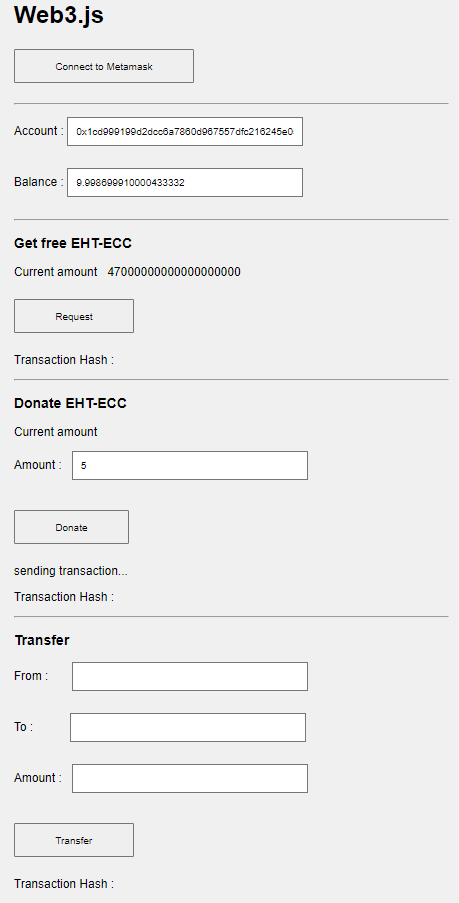

# GET FREE ETH-ECC!

/*

You can run your file in http-server.

1> Have Node.js installed in your system.

2> In CMD, run the command npm install http-server -g

3> Navigate to the specific path of your file folder in CMD and run the command http-server

4> Go to your browser and type localhost:8080. Your Application should run there.

Thanks:)

*/
